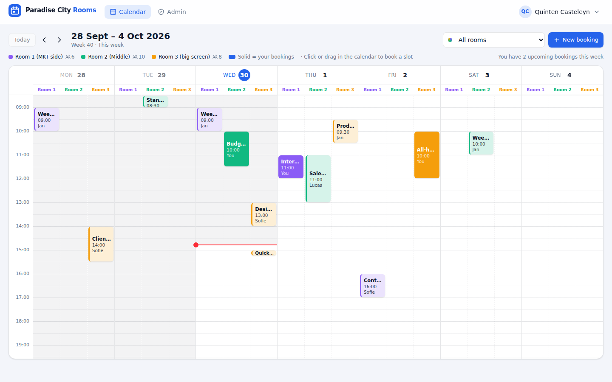
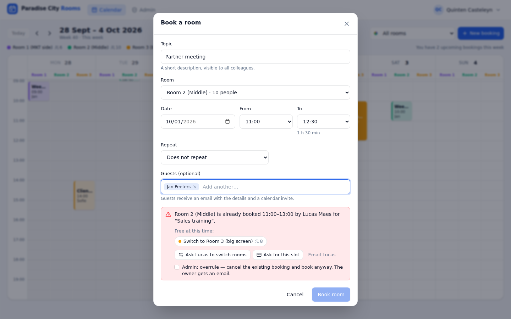
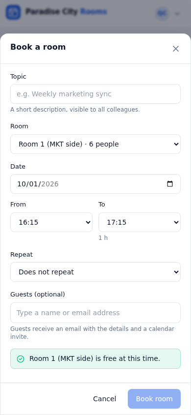

# Paradise City Rooms

Book the three meeting rooms at the Paradise City office in a Google-Calendar-like week view.

**What colleagues can do**

- Create an account with their **@paradisecity.be** or **@touquetmusicbeach.com** address (with email confirmation) and reset a forgotten password by email.
- See the **current week** (Monday–Sunday, 07:00–20:00) right away, then browse with ◀ ▶ and jump back with **Today**.
- Filter with the dropdown: **All rooms** side by side, or one room at a time.
- **Click or drag** in the calendar to book a slot, in 15-minute steps up to a full day, at most 3 months ahead.
- See who booked what, and for which topic.
- Set up **recurring bookings**: every day, weekdays, weekly, every 2 weeks, or monthly. Dates that are already taken are skipped.
- Add **guests**. They receive an email with the details and a calendar file for Outlook.
- Handle a **conflict** in a few clicks. The app shows which rooms are free, or you can use the buttons *Ask to switch rooms*, *Ask for this slot* and *Email the organiser*. Each button opens a ready-to-send email in your own mail app.
- Pick their own **colours** for the background and buttons. The choice is saved on their account and only affects them.

**What the admin (quinten@paradisecity.be) can do**

- Change or cancel any booking, or **overrule** it when booking. The original owner gets an email.
- Rename rooms and change their capacity and colour.
- Block, unblock or delete colleagues, and give other colleagues admin rights.

| Week view | Booking with conflict help | Phone |
|---|---|---|
|  |  |  |

<sub>Screenshots use made-up colleagues and bookings.</sub>

**How it's built:** a React website hosted on **GitHub Pages**, with login, the database and email functions on **Supabase**. Emails are sent through your **Microsoft 365** account. The database enforces every rule (no double bookings, opening hours and so on), so nobody can get around them.

---

## One-time setup (about 30–45 minutes)

You need to be an admin in GitHub, Supabase and Microsoft 365 (Entra ID). Do the steps in this order.

### 1. Create the Supabase project

1. Go to [supabase.com](https://supabase.com) → **New project**.
2. Name: `paradise-city-rooms`. Region: **Central EU (Frankfurt)**. Choose a strong database password and store it safely.
3. Wait until the project is ready.

### 2. Create the database

1. In Supabase, open **SQL Editor** → **New query**.
2. Open [`supabase/migrations/20260930000000_init.sql`](supabase/migrations/20260930000000_init.sql) in GitHub, copy **all** of it and paste it into the editor.
3. Click **Run**. You should see *Success. No rows returned*.

This creates the three rooms (Room 1 (MKT side) · 6 people, Room 2 (Middle) · 10, Room 3 (big screen) · 8) and all the rules.

Then run the other files in `supabase/migrations/` the same way, in date order (each one once). For example, `20261006000000_second_email_domain.sql` also allows `@touquetmusicbeach.com` addresses.

### 3. Connect the website and publish it on GitHub Pages

1. In Supabase, open **Project Settings → API Keys** (or **API**) and copy:
   - the **Project URL**, e.g. `https://abcdefgh.supabase.co`. The part before `.supabase.co` is your *project ref*.
   - the **anon / publishable** key. This key is meant to be public, and the database rules protect the data.
2. In GitHub, open this repository → **Settings → Secrets and variables → Actions → Variables** tab → **New repository variable**, and add:

   | Name | Value |
   |---|---|
   | `SUPABASE_URL` | the Project URL |
   | `SUPABASE_ANON_KEY` | the anon / publishable key |
   | `SUPABASE_PROJECT_REF` | the project ref (e.g. `abcdefgh`) |

3. **Settings → Pages** → *Build and deployment* → Source: **GitHub Actions**.
   (GitHub Pages on a *private* repository needs a paid GitHub plan.)
4. Merge this code into the `main` branch. The **Deploy website** action runs automatically (see the **Actions** tab).
   Your site will be at **`https://quintencasteleyn.github.io/meetingroombookerparadisecityoffice/`**. This address is called `APP_URL` below.

### 4. Let the app send email from Microsoft 365

The app sends all emails (account confirmation, password reset, guest invitations, admin notices) from one mailbox through Microsoft Graph.

1. **Create the sender mailbox.** In the Microsoft 365 admin center → *Teams & groups → Shared mailboxes*, create e.g. **rooms@paradisecity.be**. A shared mailbox needs no licence.
2. **Register the app.** In [entra.microsoft.com](https://entra.microsoft.com) → *App registrations* → **New registration**:
   - Name: `Paradise City Rooms`, *Accounts in this organizational directory only*, no redirect URI.
   - Copy the **Application (client) ID** and the **Directory (tenant) ID** from the overview page.
3. **API permissions** → *Add a permission* → **Microsoft Graph** → **Application permissions** → **Mail.Send** → Add, then click **Grant admin consent**.
4. **Certificates & secrets** → *New client secret* (e.g. 24 months) → copy the **Value** straight away. Put a reminder in your calendar to renew it before it expires.
5. *(Recommended)* Limit the app so it can only send as `rooms@paradisecity.be` and not as any mailbox. Microsoft calls this *RBAC for Applications* (older name: *Application Access Policy*), and you set it up in Exchange Online PowerShell.

### 5. Deploy the email and admin functions

1. Create a Supabase access token: [supabase.com/dashboard/account/tokens](https://supabase.com/dashboard/account/tokens) → *Generate new token*.
2. GitHub → **Settings → Secrets and variables → Actions → Secrets** tab → **New repository secret**: `SUPABASE_ACCESS_TOKEN` = that token.
3. GitHub → **Actions** → **Deploy Supabase functions** → **Run workflow**. When it's green, Supabase lists 3 functions under **Edge Functions**: `notify`, `admin-users` and `auth-email`.

### 6. Give the functions their settings

Supabase → **Edge Functions → Secrets** (or *Project Settings → Edge Functions*) → add:

| Name | Value |
|---|---|
| `MS_TENANT_ID` | Directory (tenant) ID from step 4 |
| `MS_CLIENT_ID` | Application (client) ID from step 4 |
| `MS_CLIENT_SECRET` | the client secret **Value** from step 4 |
| `MAIL_FROM` | `rooms@paradisecity.be` |
| `APP_URL` | `https://quintencasteleyn.github.io/meetingroombookerparadisecityoffice/` |

### 7. Configure login and emails in Supabase

1. **Authentication → URL Configuration**
   - Site URL: your `APP_URL`
   - Redirect URLs: add your `APP_URL` followed by `**`
2. **Authentication → Sign In / Providers → Email**
   - *Confirm email*: **on**
   - Minimum password length: **8**
3. **Authentication → Hooks** (or *Auth Hooks*) → **Send Email hook** → enable:
   - Type: **HTTPS**
   - URL: `https://<project-ref>.supabase.co/functions/v1/auth-email`
   - Click **Generate secret**, copy it (it starts with `v1,whsec_`) and **save** the hook.
   - Go back to **Edge Functions → Secrets** and add `SEND_EMAIL_HOOK_SECRET` = that secret.

From now on, Supabase sends confirmation and password-reset emails through your Microsoft 365 mailbox instead of its own limited mailer.

### 8. First sign-in

1. Open the website → **Create an account** with **quinten@paradisecity.be**. That account automatically becomes admin.
2. Confirm your email with the link you receive, then sign in.
3. Go to **Admin** → copy the sign-up link and share it with the team.

---

## Rules at a glance

| Rule | Value |
|---|---|
| Who can sign up | Only `@paradisecity.be` and `@touquetmusicbeach.com` addresses |
| Opening hours | 07:00–20:00, every day incl. weekends (Brussels time) |
| Booking length | 15 minutes up to the full day, in 15-minute steps |
| How far ahead | 3 months |
| Double bookings | Impossible, enforced by the database |
| Recurring bookings | Daily, weekdays, weekly, every 2 weeks, monthly (max 3 months) |
| Changing bookings | Owners change or cancel their own; admins change, cancel or overrule all |
| Colours | Personal per account |

## Changing things later

| What | Where |
|---|---|
| Room names, capacity, colours | In the app: **Admin → Rooms** |
| Admins | In the app: **Admin → Users → Make admin** |
| Allowed email domains / first admin | `handle_new_user()` in the newest SQL file that defines it, and `ALLOWED_DOMAINS` in `src/pages/AuthPages.tsx` |
| Opening hours / 3-month limit | `bookings_before_write()` in the SQL file, and `src/lib/time.ts` |
| Colour presets | `src/lib/theme.ts` |

Changes to the SQL go in a **new** file in `supabase/migrations/`, which you run in the SQL Editor. Don't re-run the first file.

## Good to know

- **Free Supabase projects pause after about a week without any activity**, e.g. during the Christmas holidays. You can wake the project up in the Supabase dashboard, or upgrade to the Pro plan to avoid this.
- The calendar updates live: when a colleague books, you see it right away.
- Emails with links open a page with a button that finishes the action. This is on purpose: Microsoft's link scanner would otherwise "use up" the one-time link before the colleague clicks it.

## Troubleshooting

| Problem | Fix |
|---|---|
| Website shows *"Almost there"* | The GitHub variables `SUPABASE_URL` / `SUPABASE_ANON_KEY` are missing. Add them and re-run **Deploy website**. |
| No confirmation / reset email | Check step 7.3 (hook enabled, secret copied) and step 6 (Microsoft secrets). Supabase → Edge Functions → `auth-email` → **Logs** shows the exact error. |
| *Microsoft login failed* in the logs | Wrong tenant/client ID or secret, or the secret expired. |
| *Sending email failed (403)* in the logs | Mail.Send is missing admin consent, or the mailbox in `MAIL_FROM` isn't allowed for the app. |
| Admin page says it can't load users | The `admin-users` function isn't deployed (step 5). |

## Developing locally

```bash
cp .env.example .env.local   # fill in the Project URL and anon key
npm install
npm run dev
```

`npm run build` type-checks and builds the site. Every pull request runs the same check on GitHub.
